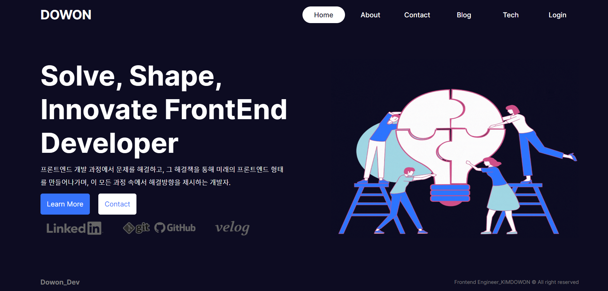

# Next.js 14 app router beginner

@ KIMDOWON 24.05.26

<h2>Next.js 14버전 app router에 대한 학습 및 내용 공유를 위한 프로젝트 제작</h2>
  <a href="https://velog.io/@korea-dollar/posts">Velog 기록</a>

### 프로젝트 기능

- admin dashboard생성하여 blog에 project와 관리하는 블로그 또는 깃헙을 올릴 수 있습니다.
- admin이 아니라면 관리자 대쉬보드를 제외하고 볼 수 있게 처리하였습니다.
- mongoDB와 연결하여 등록된 아이디와 비밀번호를 확인할 것이고 Token을 기준으로 확인하여 회원가입에서도 이미 가입된 사용자인지 확인합니다.
- 강제로 /admin페이지로 이동 시 admin으로 로그인이 안되어 있을 경우 login페이지로 이동합니다.
- 사용자 post관리 및 회원가입 가입자 확인 후 삭제 가능합니다.

## start

- npm run dev

## tech

### FE

- Next.js
- JavaScript
- bcryptjs
- @emailjs/browser
- next-auth

### BE

- mongoDB

### 프로젝트 예시 이미지

홈화면

관리자 대쉬보드

